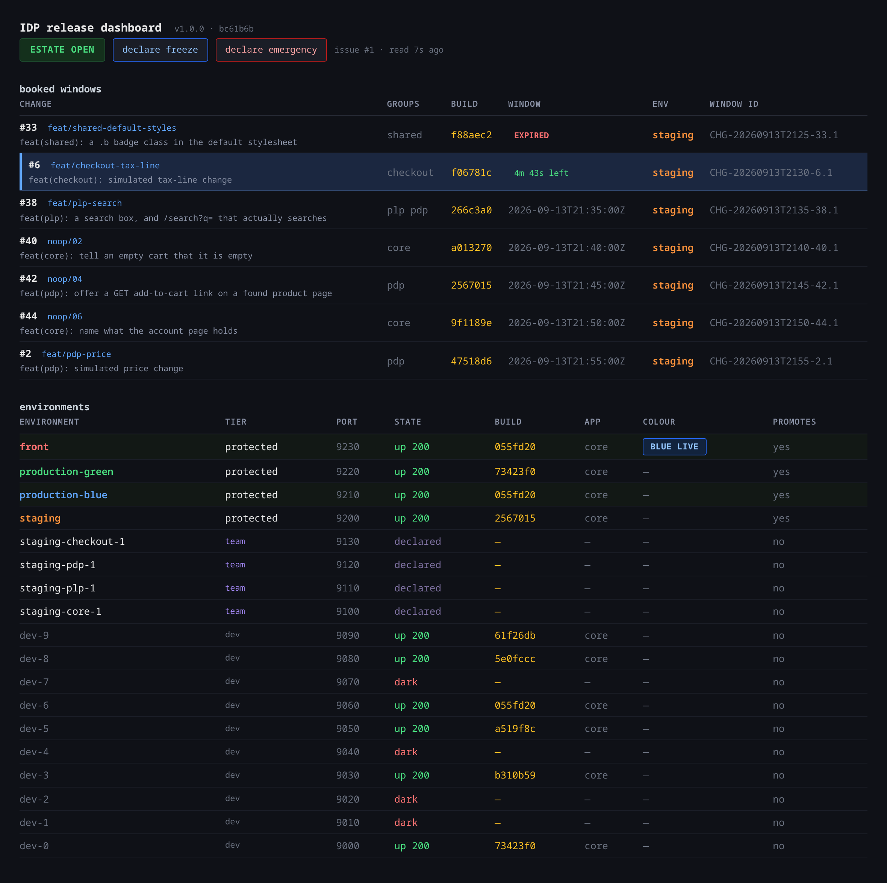
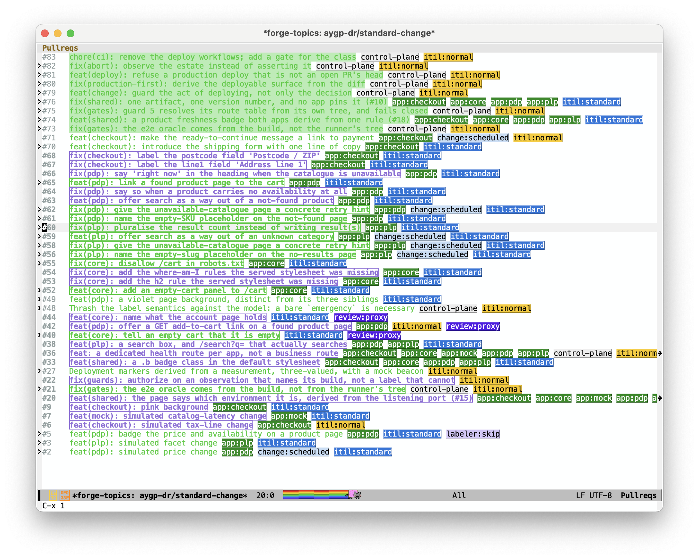

#+TITLE: standard-change
#+SUBTITLE: A label-driven, gate-checked deployment pipeline on a mock storefront monorepo
#+AUTHOR: aygp-dr
#+DATE: 2026-09-12
#+PROPERTY: header-args :mkdirp t
#+OPTIONS: toc:2 num:t

#+HTML: 

#+HTML: 
#+HTML: 
#+HTML: 
#+HTML: 
#+HTML: 
#+HTML: 
#+HTML: 

* What this is

Four mock storefront apps (=core=, =plp=, =pdp=, =checkout=) behind one router,
used as fixtures. *The product is the gate sequence*: the labels that drive it,
the environment model underneath it, the change schedule, and the guards that
make "you cannot skip staging" a structural fact rather than a convention.

=spec.org= governs. This file is derived and orients; where they disagree,
=spec.org= wins. =scenarios.org= is the test plan, =tla/= the formal model of
the promotion guards.

*What it is for.* Six properties the pipeline exists to make structural rather
than conventional. Each row names the component that carries it and the
=spec.org= section that governs it; this table indexes that document, it does
not restate it.

| Goal                                  | What makes it structural                       | In =spec.org=          |
|---------------------------------------+------------------------------------------------+------------------------|
| Intent is declared, not performed     | =release:start=, the one label a person writes | §Labels                |
| A verdict names what it measured      | records carry instrument, build, environment   | §Verification contract |
| A refusal is typed, and delivered     | "could not check" blocks, and is posted        | §Gates                 |
| Entitlement is not correctness        | window, freeze and berth, read at reliance     | §The guards            |
| The PR carries what authorizes        | estate flags deliberately live elsewhere       | §Conformance           |
| The rules are under their own control | changing a guard is itself a normal change     | §Controls audit        |

* Dashboard

=idp-dashboard/server.mjs=, port 9999. Live estate and change schedule; the
freeze and emergency toggles write to the estate issue that =gates/preflight.sh=
reads.

The same estate from Emacs, through forge: every PR with its =app:*=,
=itil:*= and =change:*= labels in one buffer. =gmake forge= pulls and lists;
=standard-change.el= holds the config.

* The flow, for a standard change

The ordinary path, end to end. Emergencies, forfeited windows and what happens
when =main= moves underneath you are all real and all deliberately absent here
— see =docs/adr/0001-automatic-promotion.org= and =scenarios.org=.

#+begin_src mermaid :eval never-export
stateDiagram-v2
    direction TB
    [*] --> Opened: PR opened, labeller sets app:* and itil:standard
    Opened --> Started: a person adds release:start
    Started --> Scheduled: window reserved -> release:scheduled
    Scheduled --> Implementing: window opens, guards re-run, berth claimed -> deploy:staging
    Scheduled --> Forfeited: window lapses unattempted -> expired
    Implementing --> Deployed: install finished -> staging:deployed
    Deployed --> Healthy: guard 5 on staging -> staging:healthy, the trigger
    Healthy --> Verified: e2e and smoke on the healthy staging -> staging:e2e, staging:smoke
    Verified --> Accepted: a person walks the estate -> staging:uat
    Accepted --> Held: a person adds staging:hold
    Held --> Accepted: the person lifts it
    Accepted --> Promoted: staging:smoke lands deploy:production (promote.yml), unless held
    Promoted --> Live: install finished -> production:deployed, then guard 5 -> production:healthy
    Live --> Authorized: guard 4 reads the stack -- a reviewer APPROVED this head, gates green on it, every observation taken on it
    Authorized --> Complete: settle asks production what it is serving NOW -> release:completed
    Complete --> Merged: squash merge, branch deleted
    Merged --> Recorded: PIR posted, while the labels are still there to read
    Recorded --> Tidied: cleanup clears every transient label, release:completed included, berth released
    Tidied --> [*]: no tombstone on this path -- the forge's mergedAt is the record
    Forfeited --> Started: the person states the intent again

    Deployed --> Closed: abort from any state past the berth claim -> release:failed or release:backed-out
    Closed --> [*]: release:ended, written last -- there is no mergedAt here, so the tombstone is the only thing saying this clearing was deliberate

    note right of Scheduled
        reserving is not deploying
    end note
    note right of Healthy
        the next step keys on the OBSERVATION
        (<env>:healthy), not on the action
        (<env>:deployed)
    end note
    note right of Live
        guard 5 asserts the SERVED build,
        not that something answered
    end note
    note right of Merged
        Merged and Tidied are two acts in
        sequence, not one. The window between
        them is real and legitimate.
    end note
#+end_src

And the same path as a sequence, showing who does what:

#+begin_src mermaid :eval never-export
sequenceDiagram
    autonumber
    actor Dev
    actor Rev as reviewer
    participant GH as forge
    participant IDP as change control
    participant Stg as staging
    participant Prod as production

    Dev->>GH: push -> PR
    GH->>GH: labeller: app:*, itil:standard
    GH->>GH: gates -> lint, test, e2e, gate-selftest (green @sha)
    Dev->>GH: release:start
    Dev->>IDP: reserve a window
    IDP-->>GH: release:scheduled
    IDP->>Stg: window opens -> re-run guards, claim the berth (deploy:staging), deploy changed apps
    Stg-->>GH: install finished -> staging:deployed
    Stg-->>GH: guard 5 on staging -> staging:healthy
    Stg-->>GH: the authorizing runs -> staging:e2e, staging:smoke
    Dev->>GH: a person walked it and accepted -> staging:uat
    Rev->>GH: APPROVED, on this head
    GH->>GH: promote.yml -- gates green, staging:e2e beside smoke, no staging:hold -> deploy:production
    IDP->>Prod: promote the digest staging tested
    Prod-->>GH: production:deployed, then guard 5 on N probes -> production:healthy
    IDP->>GH: guard 4 -- the approval on this head, the gates on this head, every observation on this head

    alt production is serving this head
        IDP->>Prod: settle: what are you serving, right now?
        Prod-->>IDP: x-build-sha, colour
        IDP->>GH: release:completed -- validation done
        IDP->>GH: merge, squash, delete the branch
        IDP->>GH: the PIR, posted while the labels are still readable
        IDP->>GH: cleanup -- clear every transient label, release:completed included, berth released
        Note over IDP,GH: no release:ended here. mergedAt is the record
        GH-->>Dev: shipped
    else it did not make it
        IDP->>GH: the closure record, then release:failed or release:backed-out
        IDP->>GH: clear every marker, close the window, release the berth
        IDP->>GH: release:ended, last -- nothing else says this clearing was deliberate
    end
#+end_src

** One label starts a change

A person adds *=release:start=* and that is the whole of their part: one
label, one fact. Everything after is the system acting or observing, and the
*name shape* says which:

| shape                | kind        | example               | added by hand? |
|----------------------+-------------+-----------------------+----------------|
| =release:start=       | intent      | someone said go       | *yes*          |
| =staging:hold=       | *intent*    | someone said not yet  | *yes*          |
| =deploy:<env>=       | action      | work is in flight     | no             |
| =<subject>:<state>=  | observation | *a check came back*   | no             |

=production:healthy= reads as a check result because that is what it is.
=deploy:staging= is not a way to ask for a deployment — it marks that the
workflow is deploying, right now.

Three things this picture claims, each checked elsewhere:
*reserving is not deploying* (guards are re-evaluated when the window
arrives), *production promotes the digest staging tested* rather than
rebuilding, and *converged is not alive* — guard 5 samples until one build
answers, or refuses.

** Passing the gates is what moves a change, not a person

*A standard change that passes its gates goes to production without anyone
moving it.* That is the decision in =docs/adr/0001-automatic-promotion.org=,
and it is the reason the gates are worth what they cost: a gate nobody trusts
enough to promote on is a report, not a gate.

So there is no "promote" button, and adding =deploy:production= by hand is not
one either — it is an *action* label, and asserting it claims the workflow is
deploying right now.

*** Change control owns the cleanup, and the deployment annotation

When a change completes, *change control* — =change/settle.sh= — runs five
discrete acts in order, and the order is the content:

1. *re-measures production against the head, now.* Not /was healthy once/: it
   asks the front what it is serving and compares =x-build-sha= to the head.
   That is guard 5 re-derived from a host that can see the estate, and it is
   better evidence than any label — so =production:healthy= is deliberately
   *not* required here.
2. *sets =release:completed=* — validation is done. Before the merge, because
   the merge follows completion rather than constituting it, and because this
   is the label that *drives* the merge and the PIR.
3. *merges* — squash, branch deleted. A refused merge *stops settlement here*:
   no PIR, no window redline, no clearing. Production is then serving
   something =main= does not contain, which is a state with a name and a
   recovery, not a silent success.
4. *posts the PIR, and writes the deployment annotation* — while the labels
   are still on the change to be read into it.
5. *cleans up* — clears every transient label, =release:completed= included, and
   with it the berth.

*Steps 3 and 5 are two acts, in sequence, and the gap between them is real.*
A change can be merged and not yet tidied: the forge says =MERGED= while
=deploy:staging= is still claimed. That window is legitimate — it is where the
PIR is written — and nothing in the model collapses it. The formal model
carries the distinction explicitly: =tidied= (the cleanup ran) is a different
variable from =cleaned= (the tombstone label is showing), split on 2026-09-15
precisely because using one to stand for the other made the merge path
re-fire.

Step 5 is the part worth naming. Clearing =deploy:staging= is not tidying: it
is the *release of the berth*, and a change that completes without clearing it
holds the path to production forever. Every other =staging:*= and
=production:*= label goes at the same time, because they described where this
change sat in the process and it is no longer in the process.

*The cleanup on the merge path stops there.* It writes nothing after the
clearing — see §The merge is the tombstone below. The *abort* path
(=change/abort.sh=) has the same shape and one more step: the closure record
first, then the deployment records withdrawn, the window redlined, every
marker cleared, the closure code (=release:failed= or =release:backed-out=), the
berth released — and then =release:ended=, last.

*The deployment annotation is written here too, and only here.* Not when the
deploy starts: a record opened at the start and resolved later resolves to
failure whenever the run dies before deploying, and a record that resolves to
failure for a deploy that never happened is a lie about the estate.

By settlement, production has been observed serving the build. There is nothing
left to intend, so the annotation is written from a fact. It is keyed to the
*SHA*, never the branch, because settlement deletes the branch and a record
tied to a branch name cannot outlive it.

*What that costs, stated rather than discovered*: the history shows no failed
deployments, because a failed deploy never reaches settlement. "No failures"
will read as "nothing ever failed". And "is a deploy in flight right now?"
cannot be answered from the records — that question belongs to the berth.

*** Two namespaces: annotations, and the record

| namespace                    | what it is                                | lifetime                        |
|------------------------------+-------------------------------------------+---------------------------------|
| =staging:*=, =production:*=  | build/deploy *annotations* — a fact about a BUILD in an ENVIRONMENT | ephemeral; cleared per change   |
| =change:*=                   | the *record* — a fact about the CHANGE    | the closure is durable; the lifecycle states are cleared at cleanup |

*Two namespaces, and they are different kinds of fact.* Mixing them is the
defect that made "a PR has at most one =change:*=" impossible to state, because
=itil:standard= plus =release:completed= was a legitimate pair:

| namespace  | kind             | members                                              | cardinality |
|------------+------------------+------------------------------------------------------+-------------|
| =itil:*=   | *classification* | =itil:standard= · =itil:normal= · =itil:emergency=   | exactly one |
| =change:*= | *lifecycle*      | =release:start= → =release:scheduled= → =release:completed= | one active |

=itil:*= is the ITIL change type and says *what kind of change this is*.
=change:*= says *where the change record has got to*. A change is classified
once and moves through the lifecycle many times.

*=app:*= and =itil:*= are guidance, not permission.* They tell the pipeline
what a change touches and what kind of change it is — which gates to run,
which groups to deploy, which rules apply. Neither authorizes anything.
Permission to deploy is four other things, each from a different source: a
person's =release:start=, a reviewer's approval, green gates on the head,
and an open window. A change with every derived label and none of those four
does not move. The one derived-looking label that changes *precedence* is
=itil:emergency=, and it is not derived: a person declares it, and it exempts
the change from the freeze and the queue, never from the gates.

=release:completed= is the pipeline's *outcome*: set when every guard has passed
and production is observed serving the build, *before* the merge, because the
merge follows completion rather than constituting it — and it is the label
that *drives the side effects*: the merge to =main=, the PIR, and whatever
else must hear that the change shipped (a ticket, a message). Cleanup then
clears it — once the forge records =MERGED=, the label restates a fact the
platform owns, and two records of one fact can disagree while the platform's
cannot. The person's three words are =release:start=, =staging:hold= and
=release:skip= (skip the estate: nothing to release, the only act left is
the merge, and only if the labeller attached no =app:*=); =complete= is the
pipeline's, and =end= is the pipeline's on one path only. The grammar these
spellings will become in rebuild 005, one namespace where the person says the
verb and the runner answers the participle, is set out in
=research/findings/release-grammar.org=.

*** The merge is the tombstone

/Two records of one fact can disagree; the platform's cannot. A label
restating a fact the platform already owns is not a second record, it is a
future contradiction with a timestamp./ That argument is why cleanup clears
=release:completed=, and it condemns =release:ended= on the same path for the same
reason: the merge already says the change ended, and the forge's =mergedAt=
says it in a field nothing in this repository can write.

The evidence is not hypothetical. PR #52 carried =release:ended= through an
entire successful deploy *while still open* — the tombstone said the cleanup
had run on a change that had not started tidying. =mergedAt= cannot do that.

The objection was also a shape objection (the owner, 2026-09-15): clearing
every label, then adding =release:ended= to say the clearing happened, then
clearing that too is /a bunch of dishes on the counter, then putting all in
the dishwasher, then putting a postit note indicating that you cleaned up the
kitchen, then tossing the postit/.

So the rule is split by path, not dropped:

| path                    | what closes it                              | tombstone |
|-------------------------+---------------------------------------------+-----------|
| *merged*                | =mergedAt=, written by the forge            | *never*   |
| *aborted* (closed unmerged) | =release:failed= / =release:backed-out=, by =change/abort.sh= | *=release:ended=, last* |

An aborted change has no =mergedAt=. A refusal at the lock, the reaper and an
eviction all leave a change with no labels too, so on that path =release:ended=
is the only thing separating a deliberate settlement from those — which is the
case it was invented for, and now the only one it serves. The invariant is
=NoTombstoneOnMerged= in =tla/Labels.tla=, under constant
=MergeIsTheTombstone=.

Measured 2026-09-15, because the document should not be read as a report on
the script: =change/settle.sh= still adds =release:ended= after the clearing, and
all ten of #110–#119 are =MERGED= carrying it. The model and this section
state the rule; the merge path's write has not been removed yet.

*Neither namespace is a blocker.* A freeze, a held berth and an emergency in
flight are facts about the *estate*, not about any change — see below.

=production:healthy= is not terminal, and neither is =staging:uat=. Neither is
about the change; both are about a build that happens to be the change's head
at this moment. Push once and both are lies — which is why the labeller
withdraws every one of them on =synchronize=, and =staging:deployed=,
=staging:healthy= and =production:deployed= with them.

*The next step keys on the observation, not the action.* =<env>:deployed= is
the deployer saying the install finished; =<env>:healthy= is guard 5's
instrument saying the environment serves this head. e2e and smoke run on
staging only once =staging:healthy= is recorded (rule =HealthyBeforeVerdict=:
a verdict on an environment not known to serve the head is a verdict about
nothing), and =staging:smoke= is what lands =deploy:production=. On the
production side, =production:healthy= after =production:deployed= is what
=merge-on-healthy= keys on. What a label *says happened* never triggers
anything; what an instrument *measured* does.

*** States the model reaches that the diagram above does not draw

=sim/label_sim.py --census= lists every per-change label shape the machine
reaches. Within depth 12 there are 173, and three are worth naming because
they are reachable today and the diagram does not show them:

| shape | how it is reached | status |
|-------+-------------------+--------|
| =deploy:production= beside a later =staging:fail= | promoted on a pass; an instrument re-runs on staging and fails; nothing withdraws the intent | *open* — should a failing verdict after promotion withdraw =deploy:production=? |
| =deploy:staging= and =deploy:production= with no =*:deployed=, no =*:healthy=, no verdict | a push: the labeller withdraws every observation and every deployed/healthy fact, and leaves the action labels | *open* — the intent was for a build that no longer exists |
| a change with no lifecycle label and a staging verdict still on it | the reaper: it removes =release:scheduled= and =deploy:staging= and leaves the observations | documented; the observations are about a head that has not changed, on an environment that is gone |

A fourth — =release:failed= beside =deploy:production= — was reachable because
=abort.sh= cleared =deploy:staging= and not =deploy:production=; it clears
both now.

It also settles what may be cleared at completion. Annotations are cleared,
because the record summarises them and the PR timeline keeps every add and
remove with actor and timestamp. The record is not.

*** Adding a label and removing it are different acts

Who may *add* a label is not the same question as who may *remove* one, and
the two labels a person adds are opposites in both directions:

| label | added by | removed by |
|----------------+---------------------------+--------------------------------|
| =release:start= | *a person only* — intent  | *automation* — the driver consumes it when it claims the berth |
| =staging:hold= | *a person only* — "not to production yet" | *a person only*; cleanup at settlement |

A person must add =release:start= because it is the intent to ship and no machine
may infer it. Automation must remove it because a trigger that stays on
re-fires, and the second firing deploys a change that is already live.

=staging:hold= is the mirror. A person must lift it, because the entire
content of a hold is that a human has not looked yet — and only that human
knows when they have. A hold a machine can clear is not a hold, it is a delay.

*** =deploy:staging= is the lock, and a refusal at it resets the change

=deploy:staging= is the environment lock: one change
holds it, guard 1 reads it, nothing else is the lock. A change that asks for
staging while another holds it is not queued and not annotated. =queue.sh=
clears *every marker it carries* — the window (closed =cancelled=), the
lifecycle, the observations, and the human intent (=release:start=, =staging:hold=) — and leaves one comment
naming the holder. The person re-states the intent when the lock is free.
Rule =LockResets= in =tla/Labels.tla=;
the negative run shows the refused change keeping its markers in six states.

*** =staging:hold= — the one human stop, at one scope

=staging:hold= is the human intent — /I want to look before this goes to production/ —
with exactly one reader and one scope: =promote.yml= reads it at the moment
it would land =deploy:production=, and lands nothing while it is present.
Nothing else reads it; the berth is not released; the gates keep running;
only the person lifts it. The rule is =HoldGuard= in =tla/Labels.tla=, and
the negative run shows =deploy:production= landing under a hold when it is
off.

*** How to stop a change

The human stops are earlier than any per-change hold:

| to stop                   | do this                        | scope |
|---------------------------+--------------------------------+-------|
| it should not go at all   | *do not add =release:start=*     | that change |
| it is not fit to ship     | *do not approve*                | that change |
| nothing should go now     | *=freeze=*                      | the estate |
| this outranks everything  | *=itil:emergency=*              | the estate's ordering |

A change nobody wants promoted is simply not requested and not approved.

* Where a person has to act

Everything else in this pipeline is a derivation. These are the points where it
*stops and waits for a human*, and they are deliberate — each one is a judgement
the pipeline is not entitled to make.

** 1. Asking for a window — =release:scheduled=

: ./change/schedule.sh block <pr> "<groups>" <minutes>            # next available
: ./change/schedule.sh block <pr> "<groups>" <minutes> --at <iso> # a named hour

*Nobody books a window for you.* There is no auto-scheduler and
=docs/adr/0003= records why: seven of eight guards do not read the calendar at
all, so scheduling is the least load-bearing thing here and a cleverer one would
only add rules that can be wrong at 3am.

Two flavours, and the difference is the point:

- *next available* — "I want the path to production, put me behind whoever is
  already waiting."
- *=--at <hour>=* — usually a developer saying /I will be at my desk then and I
  want to watch this go out./ That is why a designated slot does *not* win a
  clash and why the calendar is allowed to have holes: moving the change moves
  it away from the person who arranged to be present.

=block= refuses a window too short to hold the work — deploy and settle 3m + the
soak + 1m per extra app + 10m for control-plane. =--short= overrides, loudly.

Terms, since three are easy to blur: a *window* is the reserved interval on the
calendar; a *slot* is one calendar quantum, and a window occupies one or more
of them; the *berth* is the singleton right to be in staging, held by
=deploy:staging= and released at settlement. A window entitles a change to
claim the berth when it opens; it does not claim it.

** 2. Being there when it opens

*This is the real cost, and it is not the guards.*

A window is an entitlement, not an event. Something still has to drive the
change through it, and tonight that was always a person typing. Of roughly
thirty windows booked, *about half expired unattempted* — nobody was watching
when they opened.

That is a *control-flow path, not a failure*. The recovery is two commands and
costs the wait for the next slot, because the full cycle runs in about ninety
seconds. See =docs/adr/0003= §Missing a window.

** 3. Accepting it — =staging:uat=

: ./change/uat.sh <pr> http://127.0.0.1:9200

The one place *a person is the instrument*. Every other observation is a script
recording its own measurement; user acceptance is a human looking at a running
estate and saying it is right.

=uat.sh= re-reads the window before the walk *and again after it*, because the
walk takes time and an acceptance recorded outside the window is not an
acceptance inside it.

** 4. Declaring the class — =itil:emergency=

The labeller derives =itil:standard= from the diff. *It cannot derive an
emergency*, and must not: deciding that something is an emergency is a
declaration about the world, not a property of a diff.

** 5. Closing or opening the estate — =freeze= / =emergency=

On *issue #1*, the estate holder — never on a pull request. A PR carrying the
estate flag is a change that the same write both blocks everyone for *and*
exempts. Toggle from the dashboard or by hand; =gates/preflight.sh= reads the
same issue.

** 5b. Closing the estate for an emergency — =emergency= on issue #1, and the eviction

An emergency is stated twice, by a person both times: =itil:emergency= on
the change that is the fix, and =emergency= on the estate issue. The second
is what closes the estate. Two things follow, and only one is built:

| effect | status | where |
|--------+--------+-------|
| *nobody else enters.* Standard and normal changes are refused at preflight while the estate says emergency, the one carrying the flag included | *built* | =gates/preflight.sh= — "an EMERGENCY is in flight on the estate" |
| *whoever is in staging leaves.* A declared, booked, ready =itil:emergency= takes the berth from a standard or normal holder | *specified, unbuilt* | =tla/Labels.tla= =Evict=, rule =EmergencyPreempts=; today the emergency dies at guard 1, "staging held by #N" |

The eviction is not an abort. The evicted change did nothing wrong, so it is
not =release:failed=: it loses exactly what was about the staging it is
losing — the berth, its window (closed =cancelled=), its observations — and
keeps its class, its approval and its head. It gets no lifecycle label back,
for the reaper's reason: asking for a new window is a person's act. The
model says nothing about *who* performs the eviction; that is the next ADR's
one decision here. Either a person runs it before activating the emergency,
which is ADR 0003's no-preemption position applied to the berth, or the
emergency's activation performs it, which would be the first time the
pipeline moved a change nobody asked it to move.

To grind it: book a standard change and activate it so it holds staging;
book an =itil:emergency= change; put =emergency= on issue #1; try to
activate the emergency. Today it is refused by guard 1. With the rule, the
holder is evicted and the emergency proceeds — and the negative run in
=tla/check.sh= shows the holder surviving when the rule is off, in eight
states: Label, DeclareEmergency, Book, Book, Activate, Estate, and the
emergency waits.

** 6. Withdrawing acceptance — removing =staging:uat=

Automation may clear a label at settlement. *Only a person may withdraw an
acceptance*, because withdrawing means "I looked again and I no longer think
so", which is not something a script can mean.

** 7. Closing a change that did not make it

: ./change/abort.sh <pr> "<reason>" [--backed-out --to <sha>]

=failed= means production never served it. =backed-out= means production served
it and was returned — and that word asserts an estate action, so =--to= is
required.

** What is NOT a human decision

Worth stating, because the temptation runs the other way:

| the pipeline decides | on what |
|----------------------+---------|
| =app:*= | the diff, via the labeller |
| =itil:standard= | the diff touched only app paths |
| =staging:e2e= =smoke= =production:healthy= | the instrument's own measurement |
| whether a window is open | the clock |
| whether the gates are green *on this head* | the forge |
| whether the berth is free | one label, repo-wide |
| =expired= | the reaper, and only ever =expired= |

A person who finds themselves setting one of those by hand should ask why the
derivation is not running — that is how eight hours of hand-applied =app:*=
labels happened here while the labeller was blocked.

* Feature branches and the queue

#+begin_src mermaid :eval never-export
gitGraph
    commit id: "main@0"
    branch feat-pdp
    commit id: "pdp price fix"
    checkout main
    branch feat-plp
    commit id: "plp facets"
    checkout feat-pdp
    commit id: "review fixes"
    checkout main
    merge feat-pdp id: "main@1 (deployed)"
    checkout feat-plp
    commit id: "REBASE onto main@1"
    checkout main
    merge feat-plp id: "main@2 (deployed)"
#+end_src

=feat-plp= could not take staging while =feat-pdp= held it (guard 1), and could
not take it afterwards without the rebase (guard 0) — because deploying a tree
branched from =main@0= would have shipped a storefront missing the pdp price
fix. *The rebase is not hygiene; it is the re-verification that the two changes
compose*, and it happens before staging rather than after production.

* Environments

Three kinds of environment, and conflating them is the mistake this model
exists to prevent. *Team environments are for developing a change; staging is
the path to production.* They are not the same resource, they are not checked
out the same way, and a team environment can never promote.

#+begin_src mermaid :eval never-export
flowchart TB
    subgraph local["Local — one port block per git worktree"]
        W0["main worktree router :9000 apps :9001-9005"]
        W1["feat/pdp-price router :9010 apps :9011-9015"]
        W2["feat/plp-facets router :9020 apps :9021-9025"]
    end

    subgraph team["Team environments — parallel, disposable, NOT on the path"]
        E1["staging-core-1 :9100 cannot promote"]
        E2["staging-plp-1 :9110 cannot promote"]
        E3["staging-pdp-1 :9120 cannot promote"]
    end

    subgraph path["Path to production — singleton, queued"]
        S["staging :9200 held by ONE change at a time"]
        P["production front :9230 blue :9210 / green :9220"]
    end

    W1 --> E1
    W2 --> E2
    E1 -.->|"cannot promote"| X(("✗"))
    E2 -.->|"cannot promote"| X
    W1 -->|"release:start guards 0 and 1"| S
    S -->|"authorizing e2e passes guards 2, 4, 4b"| P
    P -->|"health check passes settle re-measures NOW"| M["merge to main"]
    M -->|"then, as a second act"| CU["cleanup every transient label berth released"]
    M -.->|"everyone else is now BEHIND main"| W2

    style S fill:#fde68a,stroke:#a16207,color:#000
    style P fill:#bbf7d0,stroke:#15803d,color:#000
    style X fill:#fecaca,stroke:#b91c1c,color:#000
#+end_src

| Environment       | Ports       | Tier        | Count       | Promotes? | Freed by                     |
|-------------------+-------------+-------------+-------------+-----------+------------------------------|
| worktree block    | *9000–9099* | *dev*       | per clone   | no        | =gmake port-free=            |
| =staging-<app>-<n>= | *9100–9199* | *team*    | many        | *no*      | change control release, or lease expiry |
| =staging=         | *9200*      | *protected* | *exactly 1* | yes       | merge, failure, or guard 4b  |
| =production= front | *9230*     | *protected* | 1           | —         | —                            |
| =production-blue= | *9210*      | *protected* | 1 (live or idle) | —    | a cutover to green           |
| =production-green= | *9220*     | *protected* | 1 (live or idle) | —    | a cutover to blue            |

*The port number is the tier.* An address below 9100 is disposable, 9100–9199
is real but cannot promote, and 9200+ is the path to production — so "which
kind of environment is this?" is answerable from the URL alone.

The asymmetry is deliberate. Team environments are cheap, many, and leased —
losing one costs a re-checkout. Staging is scarce, singular, and *queued*,
because holding it is holding the only path to production.

* The updated check, and why it is containerized

The *updated check* is guard 0 plus guard 4b: a change may only reach the path
to production while it contains the current tip of =main=, and that must be
true *at the moment it is relied on*, not merely when it was requested.

Neither treats every merge alike. =change/divergence.sh= classifies what landed:

| class      | what moved on main                        | effect                       |
|------------+-------------------------------------------+------------------------------|
| =inert=    | docs, notes, the model                     | nothing — you are not stale  |
| =pipeline= | =targets/=, =gates/=, =.github/=           | re-verify; how you ship changed |
| *=artifact=* | *=apps/=*, =router/=                     | *blocked* — you would revert it |
| *=hotfix=* | any merge carrying =Change-Type: emergency= | *blocked* — you would revert a fix |

*=apps/**= is the deployable entity*, so any change to it blocks — not just a
change to the same app. That coarseness is a property of the monorepo, and
=docs/adr/0001-automatic-promotion.org= is where the options that
remove it live.

Containers are what make this checkable rather than hopeful. One image per app,
built once, tagged by the *commit SHA*, promoted by digest:

#+begin_src mermaid :eval never-export
flowchart LR
    subgraph build["Build once, on the PR head SHA"]
        SRC["apps/GROUP"] --> IMG["ghcr.io registry tag = commit sha digest sha256"]
    end

    subgraph stagingenv["staging — the mixed-app property"]
        R1["router"] --> C1["core at prod sha"]
        R1 --> C2["plp at PR sha"]
        R1 --> C3["pdp at prod sha"]
        R1 --> C4["checkout at prod sha"]
    end

    subgraph prodenv["production"]
        R2["router"] --> D1["core"] 
        R2 --> D2["plp at PR sha"]
        R2 --> D3["pdp"]
        R2 --> D4["checkout"]
    end

    IMG -->|"only app:* groups"| C2
    stagingenv -->|"promote by DIGEST never rebuild"| prodenv
    C2 -.->|"x-build-sha header"| HC["gates/health.sh asserts served SHA"]

    style C2 fill:#fde68a,stroke:#a16207,color:#000
    style D2 fill:#bbf7d0,stroke:#15803d,color:#000
#+end_src

Three properties fall out, and each is a scenario in =scenarios.org=:

1. *Only the changed groups come from the PR.* The untouched three run the
   current production image. Staging therefore tests /this change against
   current production/, which is what makes the cross-app journeys mean
   something (scenario D2).
2. *Production promotes the digest staging tested.* It never rebuilds. A
   rebuild between staging and production is a different artifact, and every
   assurance staging bought is void.
3. *=x-build-sha= is served by the container*, so =gates/health.sh= can assert
   that the thing we deployed is the thing answering. A 200 alone passes
   through a deploy that silently did nothing (scenario D6).

The local worktree topology is the same graph with =nginx= and =node= processes
instead of containers — same router, same ports, same four upstreams. That
correspondence is the point: what you run at =:9010= is what staging runs at =:9200=.

* Interfaces, and the scheduler

The pipeline is driven by a small set of operations — reserve a window,
activate when it is due, settle with evidence (=docs/idp-api.org=). *How a
person reaches those operations is an interface concern and carries no
semantics.* An API call, an MCP server, the IDP's own UI, a chat command and a
label added by hand are all the same three verbs with different ergonomics.

Keeping that boundary is what stops the model acquiring a dependency on any one
of them. The guards live behind the API; a client that could bypass them would
not be an interface, it would be a second implementation.

#+begin_src mermaid :eval never-export
flowchart LR
    subgraph clients["interfaces — interchangeable"]
        A["API / CLI"]
        B["MCP server"]
        C["IDP web UI"]
        D["chat command"]
        E["a label added by hand"]
    end
    A --> API
    B --> API
    C --> API
    D --> API
    E --> API
    API["change control API reserve / activate / settle"] --> G["the guards"]
    G --> EST["staging, then production"]

    style API fill:#fde68a,stroke:#a16207,color:#000
    style G fill:#bbf7d0,stroke:#15803d,color:#000
#+end_src

** The contract, and four mock interfaces

=idp-api/openapi.yaml= is the three verbs, closure and the boundary as an
OpenAPI contract, with every refusal carrying fact, cost, recovery and
berth. Against it, four thin interfaces, all mock, none deploying:

| interface | run | what it is |
|-----------+-----+------------|
| the server | =gmake idp-mock= | in-memory, =:9998=; the label machine of =tla/Labels.tla= in a Map, eviction included |
| web | =http://127.0.0.1:9998/= | one page: boundary, changes, schedule, a button per verb, the refusal as returned |
| TUI | =gmake idp-tui= | one key per verb; =--run "r 62; a 62; …"= scripts a walk |
| Emacs | =M-x standard-change-idp= | the same keys, over HTTP, from =standard-change.el= |
| org-mode | =gmake idp-org= | *no HTTP*: =idp-api/idp.org= is the store as an org file, the verbs as elisp, =org-agenda= as the calendar. Single-writer by construction; not the store of record |

** The scheduler is not an interface

Activation is the one operation *no client calls*. The scheduler invokes it
when a window comes due, and it re-evaluates every guard at that moment. That
is deliberate: if a change could activate itself, the re-check would be a
convention someone remembers rather than something the system does.

** What exists, and what is work

| Piece                                   | State                                    |
|-----------------------------------------+------------------------------------------|
| Label vocabulary and guards             | specified, formally checked              |
| Guard logic in TLA+ and =sim/=          | *verified* — both directions             |
| =queue.sh=, =health.sh=, =release.sh=   | run against this forge in the 2026-09-13 grind |
| The three-verb API                      | designed (=docs/idp-api.org=), unbuilt   |
| Change schedule                         | =change/schedule.sh= is the store; a calendar would be an exporter of it, and none is wired |
| Any interface at all                    | *unbuilt*                                |

The scheduler work splits in two, and they are different problems:

- *Change windows* are a /record/. Writing one is fire-and-forget and nothing
  blocks on it.
- *Freezes and emergencies* are a /control/. The pipeline blocks on reading
  them, which makes that read a dependency in the deployment path — and a read
  failure must fail closed. That is the correct direction and still an outage,
  which is why the =EMERGENCY_CHANGE= override exists.

One word runs in two directions and is worth stating plainly: an =EMERGENCY:=
*calendar event* blocks the estate, while an =itil:emergency= *label* exempts
one change. The calendar governs everyone; the label governs one.

* Repository map

| Path            | What                                                          |
|-----------------+---------------------------------------------------------------|
| =spec.org=      | canonical governing document                                   |
| =scenarios.org= | labeller and deployment scenarios; the test plan               |
| =WALKTHROUGH.org= | how this was reasoned about, and which layer caught what     |
| =tla/=          | formal model of the promotion guards + =check.sh=              |
| =CLAUDE.md=     | derived operational contract for agents                        |
| =.meta/=        | operating disciplines and vocabulary                           |
| =apps/=         | the four fixture apps                                          |
| =router/=       | nginx template, routes, Cloudflare Worker                      |
| =gates/=        | lint, test, e2e, smoke, uat (Playwright, as-is), preflight, health |
| =change/=       | queue, schedule, reap, activate, settle (PIR, cleanup), abort, release |
| =targets/=      | =bastille= (jails) and =node= deploy backends                  |

* Status

=spec.org= is at 0.5. The gates, the guards, the schedule and settlement exist
and have been run: two of three matrix cells are observed — hydra (FreeBSD
14.4) on 2026-09-13 and the mini (macOS) on 2026-09-14 — each on the partial
tuple of node router and no browser. The TLA+ model passes both directions. The
three-verb API and any interface to it are unbuilt; the scheduler is a person
running =schedule.sh= and =activate.sh=, which =docs/adr/0003= records as the
intended shape for now.
